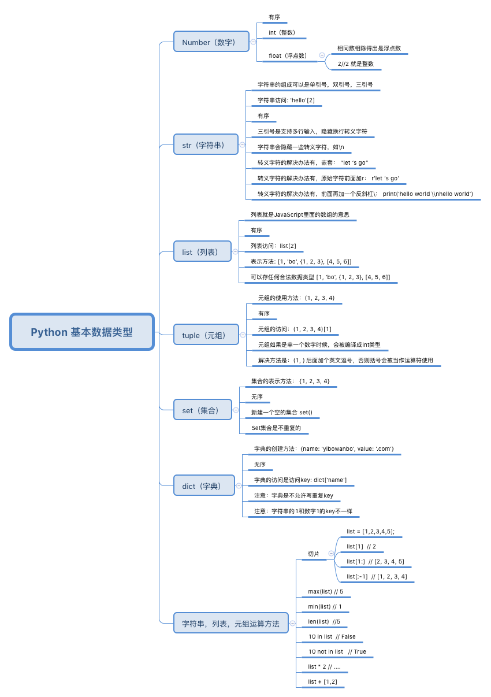

# 程序编码课程作业
161278015 李康

### Python

### 基本成分
#### 1.数据成分

  

#### 2.运算成分
赋值运算符：“＝”，算数运算符"+","-","＊","/","%"分别对应于加，减，乘，除还有取模，关系运算符“>”,"<",">=","<=","==","!=", 逻辑运算符与“&&”, 或"||",非"!"其他运算符：强制类型转换，条件运算符

#### 3.控制成分
if语句:判断语句;  while循环语句;  do-while语句:先执行循环体,然后判断循环条件是否成立. 之后继续循环;  for语句:循环,可替代while语句; 只是用法不同;  break语句跳出本层的循环;(只跳出包含此语句的循环)  continue语句:继续(一般放到循环语句里,不在执行它下面的语句,直接跳到判断语句例:for语句,就直接跳到第二个分号处,while语句,就直接跳到while()的括号里; switch语句:多相选择;  return语句:返回

#### 4.传输成分
读取键盘输入：raw_input、input。

打开和关闭文件：open、close、write、read

 


### 语言特性
[Python是个“胶水语言”，很贴近自然语言](https://github.com/taizilongxu/interview_python#python%E8%AF%AD%E8%A8%80%E7%89%B9%E6%80%A7)。它采用独特的作用域机制。ython 中，一个变量的作用域总是由在代码中被赋值的地方所决定的。 当 Python 遇到一个变量的话他会按照这样的顺序进行搜索： `本地作用域（Local）→ 当前作用域被嵌入的本地作用域（Enclosing locals）→ 全局/模块作用域（Global）→ 内置作用域（Built-in） `。另一方面，它采用特殊的垃圾回收机制。Python GC 主要使用引用计数（reference counting）来跟踪和回收垃圾。在引用计数的基础上，通过“标记-清除”（mark and sweep）解决容器对象可能产生的循环引用问题，通过“分代回收”（generation collection）以空间换时间的方法提高垃圾回收效率。

国外调查机构表明，Python已成为国外计算机科学系最为青睐的编程入门语言。可见，Python的入门门槛不高；然而，Python是伟大的，她的伟大之处在于她对其它优秀程序语言的借鉴，面向对象、函数式、闭包、包、模块化、动态加载等等特性其一一兼备。因此，要熟练掌握Python并不容易，而想成为Python编程领域的专家不仅需要了解这些Python的高阶特性还需要熟知Python生态系统中的其它组件，也需要知道Python内部实现的诸多细节以便知道何时可用何特性

## 程序分析：限价指令市场 
###Limit Order Book (LOB) 
### 项目简介
此项目是Bristol大学的一位教授写给自己学生的一个简单的限价指令市场模型，旨在可以让学生可以在该模型上，测试自己的自动交易系统。此系统模仿的是一个二级市场。

该文件为python文件，一共1205行。

它实现了一个对限价指令交易金融市场的最简单的仿真。它基于这样许多大大简化真实情况的假设。一个交易者提交一个新的单子，这个单子会在此时被交易所处理，与此同时，别的交易者在间隔为零的时间内做出反应。

### 序言性注释
BSE是一个对于LOB交易所的一个很简单的市场，基于此我们可以尝试自己的自动化交易策略。
基于五个基本假设：
1. 只存在一个被交易的股票
2. 所有的交易者只能交易一单位的股票（之后会允许交易多个）
3. 订单薄每笔订单上最多只许有一交易者
4. 交易者可以替换之前的订单，但是不可以取消
5. 交易所序贯处理每一笔订单，并且在处理完一笔订单后，将LOB公布

### 源代码分析
```Python
class Order:

        def __init__(self, tid, otype, price, qty, time):
                self.tid = tid
                self.otype = otype
                self.price = price
                self.qty = qty
                self.time = time

        def __str__(self):
                return '[%s %s P=%03d Q=%s T=%5.2f]' % (self.tid, self.otype, self.price, self.qty, self.time)

```
在此定义了订单类，注释：每笔订单都有一个交易者的id，一个价格（买价或者卖价），并且还有这个交易被完成的时间。


```Python
class Orderbook_half:

        def __init__(self, booktype, worstprice)
        def anonymize_lob(self)
        def build_lob(self)
        def book_add(self, order)
        def book_del(self, order)
        def delete_best(self)

```
Orderbook_half是订单薄的一半：一列卖价或者一列买价，每一列都是已排序的。
* `__init__(self, booktype, worstprice)`方法中，定义了订单的类型、交易者的id、匿名LOB：只保存价格数量信息的LOB、状态概述、订单量、LOB上不同的价格的数量。
* `anonymize_lob(self)`方法定义了订单的具体状态，并把它排序。
* `build_lob(self)`方法中取出一列订单，并且从中建立了一个LOB。交易所需要知道订单的到达时间，以及交易者的id，他们和交易对手之间的关系。最终LOB的返回值是一个字典（无序）。同时也建立了一个匿名LOB。
* `book_add(self, order)`方法给订单薄排序、订单重写、动态创建新的订单。
* `book_del(self, order)`方法删除订单，删除之前确认交易者确实存在。
* `delete_best(self):`方法，当买卖价格相同的时候，从订单薄中删除这两个可以被交易的订单。返回值是交易者的ID，作为这笔交易的副本记录。


```Python
class Orderbook(Orderbook_half):

        def __init__(self):
                self.bids = Orderbook_half('Bid', bse_sys_minprice)
                self.asks = Orderbook_half('Ask', bse_sys_maxprice)
                self.tape = []

```
此为单只股票的订单薄，列出了买卖价格。


```Python
class Exchange(Orderbook):

        def add_order(self, order):
        def del_order(self, order):
        def process_order2(self, time, order, verbose):
        def tape_dump(self, fname, fmode, tmode):
        def publish_lob(self, time, verbose):

```
在此定义了交易所内部的订单薄
* `add_order(self, order)`方法，向交易所内新增一个订单，并且更新所有的内部交易记录。
* `del_order(self, order)`方法，定义了删除订单的操作，并更新所有的内部交易记录。
* `process_order2(self, time, order, verbose)`方法，接受一个新的订单，并把它提交到相关的LOB上。
* `tape_dump(self, fname, fmode, tmode)`方法，进行交易时间的记录操作。
* `publish_lob(self, time, verbose)`方法，返回交易所公布的LOB信息，也就是说交易者可以到的信息。


#### 以下定义交易者的相关类
```Python
class Trader:

        def __init__(self, ttype, tid, balance):
        def __str__(self):
        def add_order(self, order):
        def del_order(self, order):
        def bookkeep(self, trade, order, verbose):
        def respond(self, time, lob, trade, verbose):

```
这个类是交易者超类，所有的交易者都有一个id、银行账户、会计记录、以及持有的一系列股票。
* `add_order(self, order)`方法中，交易者最多只允许有一个订单。可以通过讲`self.orders = [order]`修改为`self.orders.append(order)`来实现更多允许订单。
* `del_order(self, order)`方法中，假设每个交易者只有一个订单，并且订单中，要交易的股票的数量是1，所以这里是直接删除一个订单。要想升级，可以修改为删除队首的订单。
* `bookkeep(self, trade, order, verbose)`方法向交易者的会计账本中，记录交易行为。
* `respond(self, time, lob, trade, verbose)`具体区分交易者在市场中，如何对事件作出反应。


```Python
class Trader_Giveaway(Trader):

        def getorder(self, time, countdown, lob):
                if len(self.orders) < 1:
                        order = None
                else:
                        quoteprice = self.orders[0].price
                        self.lastquote = quoteprice
                        order = Order(self.tid,
                                    self.orders[0].otype,
                                    quoteprice,
                                    self.orders[0].qty,
                                    time)
                return order

```
交易者的子类，在这个类中，只进行交易，但是不会产生损失。


```Python
class Trader_ZIC(Trader):

        def getorder(self, time, countdown, lob):
                if len(self.orders) < 1:
                        # no orders: return NULL
                        order = None
                else:
                        minprice = lob['bids']['worst']
                        maxprice = lob['asks']['worst']
                        limit = self.orders[0].price
                        otype = self.orders[0].otype
                        if otype == 'Bid':
                                quoteprice = random.randint(minprice, limit)
                        else:
                                quoteprice = random.randint(limit, maxprice)
                                # NB should check it == 'Ask' and barf if not
                        order = Order(self.tid, otype, quoteprice, self.orders[0].qty, time)

                return order

```
交易者子类，第二种交易者ZI-C。


```Python
class Trader_Shaver(Trader):

        def getorder(self, time, countdown, lob):
                if len(self.orders) < 1:
                        order = None
                else:
                        limitprice = self.orders[0].price
                        otype = self.orders[0].otype
                        if otype == 'Bid':
                                if lob['bids']['n'] > 0:
                                        quoteprice = lob['bids']['best'] + 1
                                        if quoteprice > limitprice :
                                                quoteprice = limitprice
                                else:
                                        quoteprice = lob['bids']['worst']
                        else:
                                if lob['asks']['n'] > 0:
                                        quoteprice = lob['asks']['best'] - 1
                                        if quoteprice < limitprice:
                                                quoteprice = limitprice
                                else:
                                        quoteprice = lob['asks']['worst']
                        self.lastquote = quoteprice
                        order = Order(self.tid, otype, quoteprice, self.orders[0].qty, time)

                return order
```
交易者的子类，第三种交易者，Shaver。这类交易者是比较精明的，通常会交易到最好的情况，假如没有最佳价格，便在系统的最值处创造一个stub报价。


```Python
class Trader_Shaver(Trader):

        def getorder(self, time, countdown, lob):
                if len(self.orders) < 1:
                        order = None
                else:
                        limitprice = self.orders[0].price
                        otype = self.orders[0].otype
                        if otype == 'Bid':
                                if lob['bids']['n'] > 0:
                                        quoteprice = lob['bids']['best'] + 1
                                        if quoteprice > limitprice :
                                                quoteprice = limitprice
                                else:
                                        quoteprice = lob['bids']['worst']
                        else:
                                if lob['asks']['n'] > 0:
                                        quoteprice = lob['asks']['best'] - 1
                                        if quoteprice < limitprice:
                                                quoteprice = limitprice
                                else:
                                        quoteprice = lob['asks']['worst']
                        self.lastquote = quoteprice
                        order = Order(self.tid, otype, quoteprice, self.orders[0].qty, time)

                return order
```
交易者的子类，第四类交易者，Sniper。在Shaver的基础上创造出来的。具有很强的进取心。


```Python
class Trader_Shaver(Trader):

        def getorder(self, time, countdown, lob):
        def __init__(self, ttype, tid, balance):
        def getorder(self, time, countdown, lob):
        def respond(self, time, lob, trade, verbose):
            def target_up(price):
            def target_down(price):
            def willing_to_trade(price):
            def profit_alter(price):
        if lob_best_bid_p != None:
        if lob_best_ask_p != None:
        if verbose and (bid_improved or bid_hit or ask_improved or ask_lifted):
        if self.job == 'Ask':
        if self.job == 'Bid':
        self.prev_best_bid_p = lob_best_bid_p
        self.prev_best_bid_q = lob_best_bid_q
        self.prev_best_ask_p = lob_best_ask_p
        self.prev_best_ask_q = lob_best_ask_q       
        
```
交易者的子类，第五类交易者，模仿了绝大多数的交易行为。同时可以记住前后的交易信息。


## 修改自己的代码
根据示例的注释，新增自己代码的注释如下。

```Python
def get_blog_list_common_data(request, blogs_all_list):
    paginator = Paginator(blogs_all_list, settings.EACH_PAGE_BLOGS_NUMBER)
    page_num = request.GET.get('page', 1) # 获取url的页面参数（GET请求）
    page_of_blogs = paginator.get_page(page_num)
    currentr_page_num = page_of_blogs.number # 获取当前页码
    # 获取当前页码前后各2页的页码范围
    page_range = list(range(max(currentr_page_num - 2, 1), currentr_page_num)) + \
                 list(range(currentr_page_num, min(currentr_page_num + 2, paginator.num_pages) + 1))
    # 加上省略页码标记
    if page_range[0] - 1 >= 2:
        page_range.insert(0, '...')
    if paginator.num_pages - page_range[-1] >= 2:
        page_range.append('...')
    # 加上首页和尾页
    if page_range[0] != 1:
        page_range.insert(0, 1)
    if page_range[-1] != paginator.num_pages:
        page_range.append(paginator.num_pages)

    # 获取日期归档对应的博客数量
    blog_dates = Blog.objects.dates('created_time', 'month', order="DESC")
    blog_dates_dict = {}
    for blog_date in blog_dates:
        blog_count = Blog.objects.filter(created_time__year=blog_date.year, 
                                         created_time__month=blog_date.month).count()
        blog_dates_dict[blog_date] = blog_count

    context = {}
    context['blogs'] = page_of_blogs.object_list
    context['page_of_blogs'] = page_of_blogs
    context['page_range'] = page_range
    context['blog_types'] = BlogType.objects.annotate(blog_count=Count('blog'))
    context['blog_dates'] = blog_dates_dict
    return context
```

```Python
def like_change(request):
    user = request.user
    if not user.is_authenticated:
        return ErrorResponse(400, 'user is not login')

    try:
        content_type = request.GET.get('content_type')
        content_type = ContentType.objects.get(model=content_type)
        
        object_id = int(request.GET.get('object_id'))
        model_class = content_type.model_class()
        model_object = model_class.objects.get(pk=object_id)
    except ObjectDoesNotExist:
        return ErrorResponse(401, 'object does not exist')    

    if request.GET.get('is_like') == 'true':
        # 点赞，添加点赞记录，点赞总数+1
        like_record, created = LikeRecord.objects.get_or_create(content_type=content_type, object_id=object_id, user=user)
        if created:
            like_count, created = LikeCount.objects.get_or_create(content_type=content_type, object_id=object_id)
            like_count.liked_num += 1
            like_count.save()
            return SuccessResponse(like_count.liked_num)
        else:
            # 已经点赞过了，不能再记录
            return ErrorResponse(402, 'you were liked')
    else:
        # 取消点赞，删除点赞记录，点赞总数-1
        if LikeRecord.objects.filter(content_type=content_type, object_id=object_id, user=user).exists():
            like_record = LikeRecord.objects.get(content_type=content_type, object_id=object_id, user=user)
            like_record.delete()
            like_count, created = LikeCount.objects.get_or_create(content_type=content_type, object_id=object_id)
            if not created:
                like_count.liked_num -= 1
                like_count.save()
                return SuccessResponse(like_count.liked_num)
            else:
                return ErrorResponse(403, 'data error')
        else:
            # 没有点赞记录，不能操作
            return ErrorResponse(404, 'you were not liked')
```


```JavaScript
<script>
    // 图表配置
    var options = {
        chart: { type: 'line' },
        title: { text: null },
        xAxis: {
            categories: {{ dates| safe }},   // x 轴分类
    tickmarkPlacement: 'on',
        title: { text: '前7日阅读量变化' },
            },
    yAxis: {
        title: { text: null },
        labels: { enabled: false },
        gridLineDashStyle: 'Dash',
            },
    series: [{                              // 数据列
        name: '阅读量',                     // 数据列名
        data: {{ read_nums }}               // 数据
            }],
        plotOptions: {
        line: {
            dataLabels: {
                enabled: true
            }
        }
    },
    legend: { enabled: false },
    credits: { enabled: false },
        };
    // 图表初始化函数
    var chart = Highcharts.chart('container', options);
</script>

```
